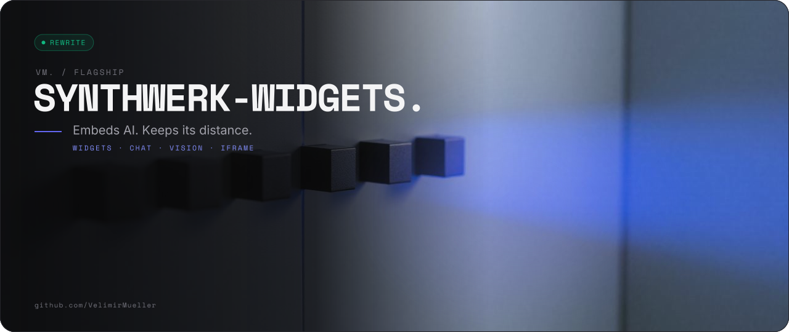
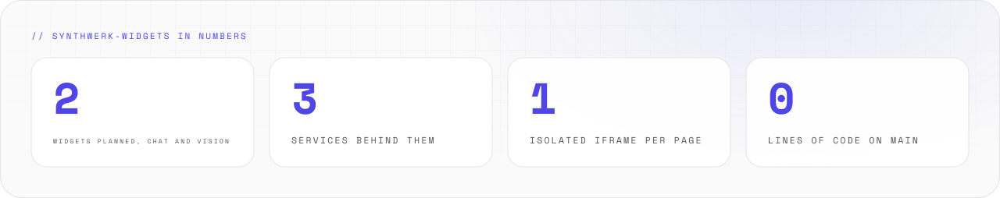
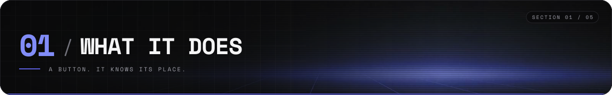
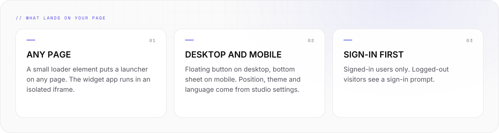
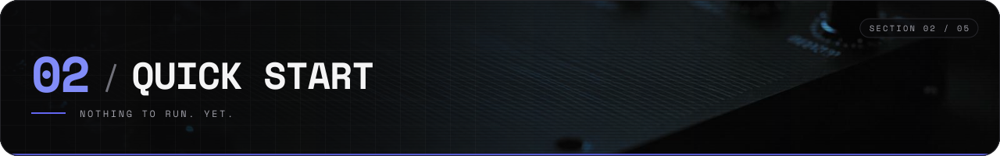
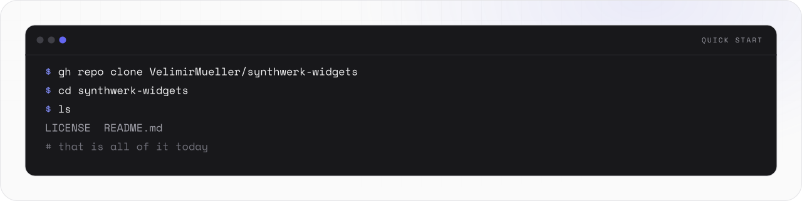
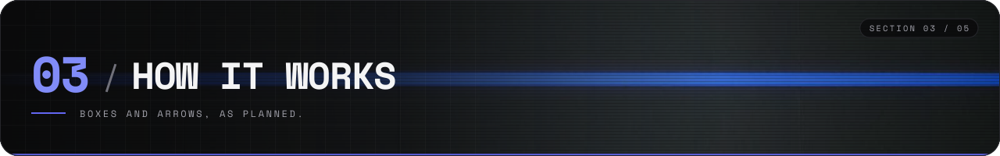
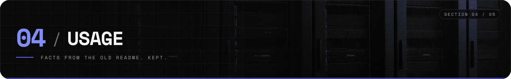
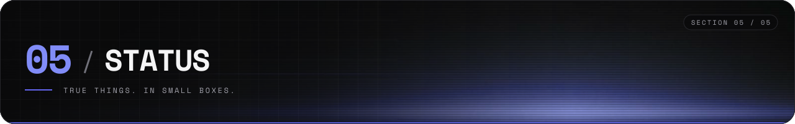
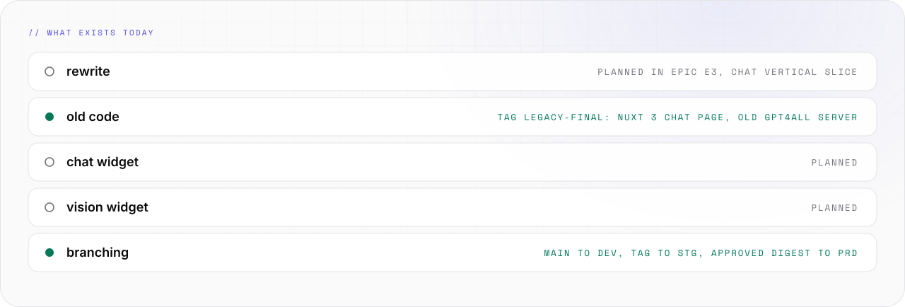

<picture>
  <source media="(prefers-color-scheme: light)" srcset="assets/banner/hero-v2-light.svg">
  
</picture>

<p align="center">

[](#-05-status) [](https://github.com/VelimirMueller) [](LICENSE) [](#-01-what-it-does)

</p>

> Embeds AI. Keeps its distance.

```text
 █████  ██  ██  ██  ██  ██████  ██  ██  ██   ██  ██████  █████   ██  ██
██      ██  ██  ███ ██    ██    ██  ██  ██   ██  ██      ██  ██  ██ ██
 ████    ████   ██████    ██    ██████  ██ █ ██  █████   █████   ████
    ██    ██    ██ ███    ██    ██  ██  ███████  ██      ██ ██   ██ ██
█████     ██    ██  ██    ██    ██  ██   ██ ██   ██████  ██  ██  ██  ██  ██
██   ██  ██████  █████    █████  ██████  ██████   █████
██   ██    ██    ██  ██  ██      ██        ██    ██
██ █ ██    ██    ██  ██  ██ ███  █████     ██     ████
███████    ██    ██  ██  ██  ██  ██        ██        ██
 ██ ██   ██████  █████    █████  ██████    ██    █████   ██

 ------  embeddable chat and vision widgets  -------------------------------
```

**synthwerk-widgets** holds the embeddable AI chat and vision widgets for [synthwerk](https://github.com/VelimirMueller/synthwerk).
The rewrite is planned. Until then, `main` holds a README. It holds it well.

<picture>
  <source media="(prefers-color-scheme: dark)" srcset="assets/readme/stats-v2-dark.svg">
  
</picture>

<br>

## // 01 WHAT IT DOES



<picture>
  <source media="(prefers-color-scheme: dark)" srcset="assets/readme/features-v2-dark.svg">
  
</picture>

- One loader element puts a launcher on the page. The widget app runs in an isolated iframe.
- Floating button on desktop, bottom sheet on mobile.
- Position, theme and language come from studio settings.
- Signed-in users only. Logged-out visitors see a sign-in prompt.

<br>

## // 02 QUICK START



<picture>
  <source media="(prefers-color-scheme: dark)" srcset="assets/readme/start-v2-dark.svg">
  
</picture>

```bash
gh repo clone VelimirMueller/synthwerk-widgets
cd synthwerk-widgets
ls   # LICENSE and README.md, that is all of it today
```

- There is nothing to install, build or run yet. This is the honest quick start.

<br>

## // 03 HOW IT WORKS



<picture>
  <source media="(prefers-color-scheme: dark)" srcset="assets/readme/flow-v2-dark.svg">
   LOADER -> IFRAME -> SERVICES. The iframe isolates the widget from the host page. On purpose." src="assets/readme/flow-v2-light.svg" width="100%">
</picture>

```text
 +--------+        +--------+        +---------------+
 |  any   |        | loader |        | widget iframe |
 |  page  |------->| element|------->| chat, vision  |
 +--------+        +--------+        +-------+-------+
                                          |  |  |
                 +------------------------+  |  +------------+
                 |                           |               |
            +----v---+                  +----v---+     +-----v----+
            |   llm  |                  | vision |     | identity |
            +--------+                  +--------+     +----------+
```

- The widget calls `synthwerk-llm`, `synthwerk-vision` and `synthwerk-identity`.
- The host page only meets the loader element. The iframe keeps the rest away from it.

<br>

## // 04 USAGE



### Where it fits

- Ecosystem map: [synthwerk](https://github.com/VelimirMueller/synthwerk).
- Shared CI, lint configs and templates: [synthwerk-blueprint](https://github.com/VelimirMueller/synthwerk-blueprint).
- This repo was renamed. The old URL still redirects here.

### Old code

- Tag [`legacy-final`](../../tree/legacy-final): a Nuxt 3 chat page for the old GPT4All server.

### Branching

- `main` deploys to dev, a `vX.Y.Z` tag to stg, an approved digest to prd.

<br>

## // 05 STATUS



<picture>
  <source media="(prefers-color-scheme: dark)" srcset="assets/readme/status-v2-dark.svg">
  
</picture>

```text
[ STATUS ]  rewrite planned, epic E3
[ WORKS  ]  the README
[ NEXT   ]  chat vertical slice
```

There is no code and no test command yet. When the rewrite lands, the blueprint CI runs on every PR.

<br>

```text
-- EOF ------------------------------------------------ STAYS IN ITS FRAME --
```

---

<sub>VM. studio / flagship · open source · look per <code>vm-brand</code> playbook · [MIT](LICENSE) © 2026 Velimir Mueller</sub>
