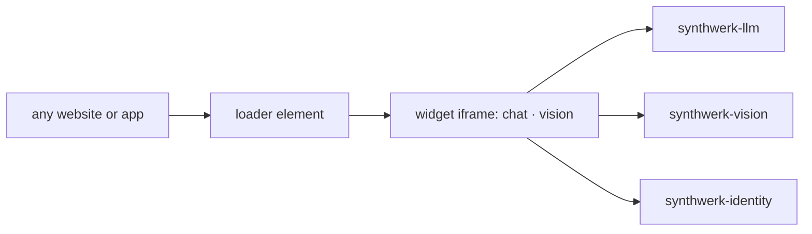

# synthwerk-widgets

**Synthwerk** · embeddable AI chat and vision widgets

## In 30 seconds

- A small loader element puts a launcher on any page. The widget app runs in an isolated iframe.
- Floating button on desktop, bottom sheet on mobile. Position, theme and language come from studio settings.
- Signed-in users only. Logged-out visitors see a sign-in prompt.

## Where it fits

- Ecosystem map: [synthwerk](https://github.com/VelimirMueller/synthwerk).
- Shared CI, lint configs and templates: [synthwerk-blueprint](https://github.com/VelimirMueller/synthwerk-blueprint).

## Status

| Item | State |
|---|---|
| Rewrite | Planned in epic **E3 Chat vertical slice** |
| Old code | Tag [`legacy-final`](../../tree/legacy-final): a Nuxt 3 chat page for the old GPT4All server |
| Branching | `main` deploys to dev, a `vX.Y.Z` tag to stg, an approved digest to prd |

- This repo was renamed. The old URL still redirects here.
